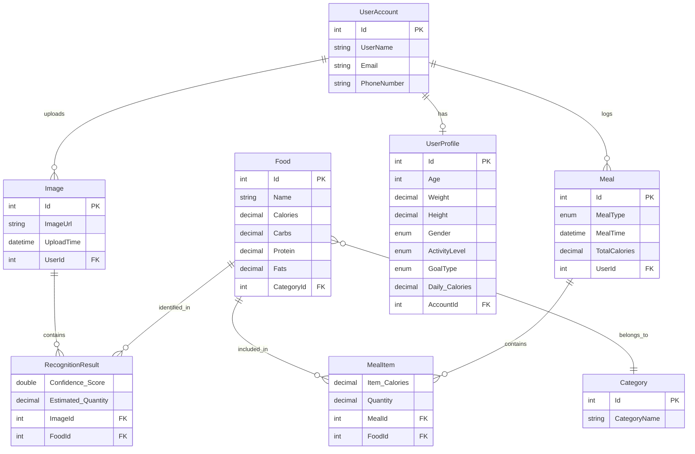

<div align="center">

# 🍽️ Food Recognition App

### AI-Powered Food Recognition & Nutrition Tracking System

[](https://dotnet.microsoft.com/)
[](https://docs.microsoft.com/en-us/ef/core/)
[](https://www.microsoft.com/en-us/sql-server)
[](https://jwt.io/)
[](https://swagger.io/)

**A RESTful Web API that leverages AI to recognize food from images, track nutritional intake, and help users manage their daily meals — built with Clean Architecture principles.**

---

</div>

## 📌 Table of Contents

- [Overview](#-overview)
- [Features](#-features)
- [Architecture](#-architecture)
- [Tech Stack](#-tech-stack)
- [Project Structure](#-project-structure)
- [Database Schema](#-database-schema)
- [API Endpoints](#-api-endpoints)
- [Getting Started](#-getting-started)
- [Configuration](#-configuration)
- [Postman Collection](#-postman-collection)
- [Contributing](#-contributing)

---

## 🔍 Overview

**Food Recognition App** is a graduation project that provides an intelligent food recognition system. Users can upload food images to get AI-powered recognition results with nutritional information, log their daily meals, track calorie intake, and manage their health profiles — all through a clean RESTful API.

The system integrates with an external **AI classification model** hosted on Hugging Face Spaces to identify foods from images and return confidence scores along with detailed nutritional data (calories, protein, carbs, fats).

---

## ✨ Features

| Feature | Description |
|---------|-------------|
| 🤖 **AI Food Recognition** | Upload a food image and get instant recognition with confidence scores & nutrition info |
| 🔐 **Authentication & Authorization** | Full JWT-based auth system with register, login, and role-based access |
| 🔑 **Password Recovery** | OTP-based forgot password flow with email verification via SendGrid |
| 👤 **User Profiles** | Health profile setup with age, weight, height, gender, activity level & fitness goals |
| 🍽️ **Meal Logging** | Log meals with multiple food items and automatic calorie calculation |
| 📊 **Daily Summary** | Get daily nutritional summary with total calories, protein, carbs & fats |
| 📅 **Meal History** | Browse meal history by date |
| 🗂️ **Food Database** | Pre-seeded database with categorized foods and nutritional data |
| ⚠️ **Global Error Handling** | Centralized error handling middleware with structured error responses |
| 📝 **Validation** | Request validation with detailed field-level error messages |

---

## 🏗️ Architecture

The project follows **Clean Architecture** principles with clear separation of concerns:

```
┌──────────────────────────────────────────────────────┐
│                   FoodRecognitionApp.Web              │
│              (Entry Point / Composition Root)         │
├──────────────────────────────────────────────────────┤
│                                                      │
│  ┌─────────────────────┐  ┌────────────────────────┐ │
│  │   Infrastructure     │  │       Core             │ │
│  │                     │  │                        │ │
│  │  ┌───────────────┐  │  │  ┌──────────────────┐  │ │
│  │  │  Persistence  │  │  │  │     Domain       │  │ │
│  │  │  - DbContext  │  │  │  │  - Entities      │  │ │
│  │  │  - Repos      │  │  │  │  - Contracts     │  │ │
│  │  │  - UnitOfWork │  │  │  │  - Exceptions    │  │ │
│  │  └───────────────┘  │  │  └──────────────────┘  │ │
│  │                     │  │                        │ │
│  │  ┌───────────────┐  │  │  ┌──────────────────┐  │ │
│  │  │ Presentation  │  │  │  │ Services.Abstr.  │  │ │
│  │  │  - Controllers│  │  │  │  - Interfaces    │  │ │
│  │  └───────────────┘  │  │  └──────────────────┘  │ │
│  │                     │  │                        │ │
│  └─────────────────────┘  │  ┌──────────────────┐  │ │
│                           │  │    Services       │  │ │
│  ┌─────────────────────┐  │  │  - Auth          │  │ │
│  │      Shared         │  │  │  - AI Model      │  │ │
│  │  - DTOs             │  │  │  - FoodRecog.    │  │ │
│  │  - Error Models     │  │  │  - Meals         │  │ │
│  │  - JWT Options      │  │  │  - Profile       │  │ │
│  └─────────────────────┘  │  │  - Email         │  │ │
│                           │  └──────────────────┘  │ │
│                           └────────────────────────┘ │
└──────────────────────────────────────────────────────┘
```

### Design Patterns Used

- **Repository Pattern** — Abstracted data access via `IGenericRepository<T>`
- **Unit of Work** — Coordinated transactions across repositories
- **Specification Pattern** — Encapsulated query logic with `ISpecification<T>`
- **Service Manager** — Façade pattern to aggregate all business services
- **Dependency Injection** — IoC container for loose coupling

---

## 🛠️ Tech Stack

| Category | Technology |
|----------|-----------|
| **Framework** | ASP.NET Core 10.0 (Web API) |
| **Language** | C# 13 |
| **ORM** | Entity Framework Core 10.0 |
| **Database** | SQL Server |
| **Authentication** | ASP.NET Core Identity + JWT Bearer Tokens |
| **AI Integration** | External AI Model API (Hugging Face Spaces) |
| **Email Service** | SendGrid API |
| **API Docs** | Swagger / OpenAPI |
| **Architecture** | Clean Architecture |

---

## 📁 Project Structure

```
FoodRecognitionApp/
│
├── Core/
│   ├── FoodRecognitionApp.Domain/           # Domain Layer
│   │   ├── Entities/                        # Domain entities (Food, Meal, Image, etc.)
│   │   │   └── Enums/                       # Enums (MealType, GoalType, ActivityLevel, Gender)
│   │   ├── Contracts/                       # Repository & UoW interfaces
│   │   └── Exceptions/                      # Custom domain exceptions
│   │
│   ├── FoodRecognitionApp.Services.Abstraction/  # Service interfaces
│   │   ├── Auth/                            # IAuthService
│   │   ├── FoodRecognition/                 # IFoodRecognitionService
│   │   ├── Meals/                           # IMealService
│   │   ├── Profile/                         # IProfileService
│   │   ├── AIModel/                         # IAIModelService
│   │   ├── Email/                           # IEmailService
│   │   └── AttachmentService/               # IAttachmentService
│   │
│   └── FoodRecognitionApp.Services/         # Service implementations
│       ├── Auth/                            # Authentication & authorization logic
│       ├── FoodRecognition/                 # Food recognition orchestration
│       ├── Meals/                           # Meal logging & tracking
│       ├── Profile/                         # User profile management
│       ├── AIModel/                         # AI model HTTP client
│       ├── Email/                           # SendGrid email integration
│       └── Specifications/                  # Query specifications
│
├── Infrastructure/
│   ├── FoodRecognitionApp.Persistence/      # Data Access Layer
│   │   ├── Data/Contexts/                   # EF Core DbContext
│   │   ├── Repositories/                    # Generic repository implementation
│   │   ├── UnitOfWork.cs                    # Unit of Work implementation
│   │   └── DbIntializer.cs                 # Database seeding
│   │
│   └── FoodRecognitionApp.Presentation/     # API Controllers
│       ├── AuthController.cs                # Auth endpoints
│       ├── FoodRecognitionController.cs     # Recognition endpoints
│       ├── MealController.cs                # Meal endpoints
│       └── ProfileController.cs             # Profile endpoints
│
├── FoodRecognitionApp.Shared/               # Cross-cutting concerns
│   ├── Dtos/                                # Data Transfer Objects
│   ├── ErrorModels/                         # Structured error responses
│   └── JwtOptions.cs                        # JWT configuration model
│
├── FoodRecognitionApp.Web/                  # Entry Point
│   ├── Program.cs                           # App configuration & DI setup
│   ├── Middlewares/                          # Global error handling middleware
│   └── wwwroot/                             # Static files & seed data
│
└── FoodRecognitionApp.postman_collection.json  # Postman API collection
```

---

## 🗃️ Database Schema



---

## 🔌 API Endpoints

### 🔐 Authentication — `/api/Auth`

| Method | Endpoint | Description | Auth |
|--------|----------|-------------|------|
| `POST` | `/api/Auth/register` | Register a new user account | ❌ |
| `POST` | `/api/Auth/login` | Login and receive JWT token | ❌ |
| `GET` | `/api/Auth` | Get current authenticated user | ✅ |
| `POST` | `/api/Auth/forgot-password` | Request OTP for password reset | ❌ |
| `POST` | `/api/Auth/verify-otp` | Verify OTP code | ❌ |
| `POST` | `/api/Auth/reset-password` | Reset password with OTP | ❌ |

### 👤 Profile — `/api/Profile`

| Method | Endpoint | Description | Auth |
|--------|----------|-------------|------|
| `POST` | `/api/Profile/setup` | Create user health profile | ✅ |
| `PUT` | `/api/Profile/update` | Update user health profile | ✅ |

### 🤖 Food Recognition — `/api/FoodRecognition`

| Method | Endpoint | Description | Auth |
|--------|----------|-------------|------|
| `POST` | `/api/FoodRecognition/recognize` | Upload image for AI food recognition | ✅ |
| `GET` | `/api/FoodRecognition/recent` | Get recent recognition results | ✅ |

### 🍽️ Meals — `/api/Meal`

| Method | Endpoint | Description | Auth |
|--------|----------|-------------|------|
| `GET` | `/api/Meal/foods` | Get all available foods | ✅ |
| `POST` | `/api/Meal/log` | Log a new meal with food items | ✅ |
| `PUT` | `/api/Meal/{mealId}/type` | Update meal type | ✅ |
| `PUT` | `/api/Meal/{mealId}/items` | Update meal food items | ✅ |
| `DELETE` | `/api/Meal/{mealId}` | Delete a meal | ✅ |
| `GET` | `/api/Meal/today` | Get today's meals | ✅ |
| `GET` | `/api/Meal/daily-summary` | Get daily nutritional summary | ✅ |
| `GET` | `/api/Meal/history?date=YYYY-MM-DD` | Get meal history for a specific date | ✅ |

---

## 🚀 Getting Started

### Prerequisites

- [.NET 10.0 SDK](https://dotnet.microsoft.com/download/dotnet/10.0)
- [SQL Server](https://www.microsoft.com/en-us/sql-server) (LocalDB or full instance)
- [Visual Studio 2022+](https://visualstudio.microsoft.com/) or [VS Code](https://code.visualstudio.com/)

### Installation

1. **Clone the repository**
   ```bash
   git clone https://github.com/mohamedelbakry1/FoodRecognitionApp.git
   cd FoodRecognitionApp
   ```

2. **Configure the database connection**

   Update `appsettings.json` in the `FoodRecognitionApp.Web` project:
   ```json
   {
     "ConnectionStrings": {
       "DefaultConnection": "Server=YOUR_SERVER;Database=FoodRecognitionAppDb;Trusted_Connection=True;MultipleActiveResultSets=true;TrustServerCertificate=True"
     }
   }
   ```

3. **Configure User Secrets** (for sensitive settings)
   ```bash
   cd FoodRecognitionApp.Web
   dotnet user-secrets set "JwtOptions:SecurityKey" "your-super-secret-key-here"
   dotnet user-secrets set "JwtOptions:Issuer" "FoodRecognitionApp"
   dotnet user-secrets set "JwtOptions:Audience" "FoodRecognitionAppUsers"
   dotnet user-secrets set "EmailSettings:ApiKey" "your-sendgrid-api-key"
   ```

4. **Run the application**
   ```bash
   dotnet run --project FoodRecognitionApp.Web
   ```

5. **Access Swagger UI**

   Navigate to `https://localhost:{port}/swagger` to explore and test the API.

> **Note:** The database will be automatically created and seeded with food categories and items on first run via the `DbInitializer`.

---

## ⚙️ Configuration

| Setting | Description | Location |
|---------|-------------|----------|
| `ConnectionStrings:DefaultConnection` | SQL Server connection string | `appsettings.json` |
| `JwtOptions:SecurityKey` | JWT signing key | User Secrets |
| `JwtOptions:Issuer` | JWT token issuer | User Secrets |
| `JwtOptions:Audience` | JWT token audience | User Secrets |
| `AiModel:BaseUrl` | AI classification model API URL | `appsettings.json` |
| `AiModel:TimeoutSeconds` | AI model request timeout | `appsettings.json` |
| `EmailSettings:ApiKey` | SendGrid API key for emails | User Secrets |

---

## 📬 Postman Collection

A ready-to-use Postman collection is included in the repository:

📄 **`FoodRecognitionApp.postman_collection.json`**

### Setup:
1. Import the collection into [Postman](https://www.postman.com/)
2. The `{{baseUrl}}` variable defaults to `https://localhost:7000`
3. Register or login — the token is **auto-saved** to the `{{token}}` variable
4. All authenticated endpoints will automatically use the saved token

---

## 🤝 Contributing

Contributions are welcome! Please follow these steps:

1. Fork the repository
2. Create a feature branch (`git checkout -b feature/amazing-feature`)
3. Commit your changes (`git commit -m 'Add amazing feature'`)
4. Push to the branch (`git push origin feature/amazing-feature`)
5. Open a Pull Request

---

<div align="center">

**Built with ❤️ as a Graduation Project**

</div>
